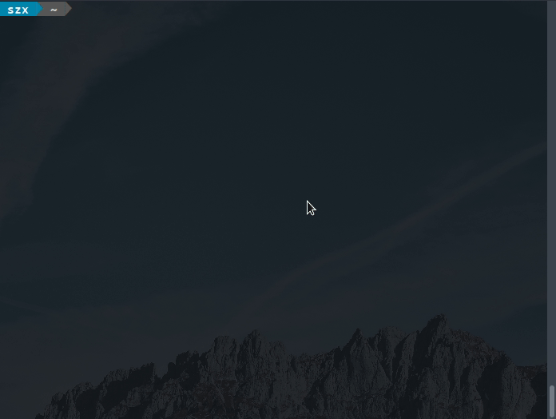

RCON
====

[![Build Status][build_status]][build]
[![Build Status - Windows][build_status_win]][build_win]

A simple cross-platform RCON client for SA-MP - works on Linux, macOS, Windows.



```
Usage: rcon [options]

--help                     show this helpful message and exit
-h, --host <hostname>      name or IP address of SA-MP server (default is 127.0.0.1)
-p, --password <string>    RCON password
-P, --port <port>          server port (default is 7777)
-c, --command <command>    execute command and exit
-t, --timeout <number>     command timeout in milliseconds (default is 150ms)
-i, --interactive          run in interactive mode
```

[build]: https://travis-ci.org/Zeex/samp-rcon
[build_status]: https://travis-ci.org/Zeex/samp-rcon.svg?branch=master
[build_win]: https://ci.appveyor.com/project/Zeex/samp-rcon/branch/master
[build_status_win]: https://ci.appveyor.com/api/projects/status/q787ukgn4jcn2ct1/branch/master?svg=true
